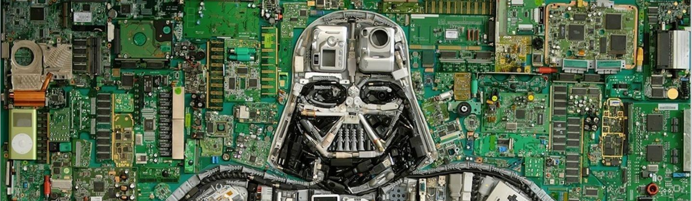

  

<h1 align="center">Hi 👋, I'm Ayoub Zekhnini</h1>
<h3 align="center">A passionate software engineering student from Belgium</h3>

 
## Me : 

As a driven and passionate computer science student at ECAM. I am passionate about the world of technology and software development. My academic background has allowed me to develop a strong understanding of industrial engineering concepts, but it is in the field of artificial intelligence that I find my true passion.

My keen interest in software development, with a particular focus on artificial intelligence, has led me to explore various aspects of this ever-evolving field. I am fascinated by areas such as Machine Learning, which opens the door to systems capable of learning and improving autonomously. Deep Learning, with its deep neural networks, excites me for their ability to tackle complex problems and surpass the limits of artificial perception. Additionally, natural language processing (NLP) captivates me as it enables machines to understand and communicate with humans in a more natural and fluid manner.

## Favorite project : 

- [Tower Defense](https://github.com/Zekhayoub/TowerDefense): Creation of a video game

## About me :

- 🔭 I am currently looking for an internship in artificial intelligence to apply my knowledge and gain hands-on experience in this exciting field.
- 👯 I’m looking to collaborate on innovative AI projects that push the boundaries of what's possible and create solutions that can make a real impact on society.
- 🤝 I’m looking for help with honing my skills in natural language processing and deep learning techniques, as I believe in the power of community and learning from others.
- 🌱 I’m currently learning the latest advancements in neural network architectures, reinforcement learning, and the ethical considerations surrounding AI technology.

## Languages and Tools :

          

## More information :
I've been a GitHub user for 0 years and have made 129 commits to 17 repositories during that time.

&nbsp;

